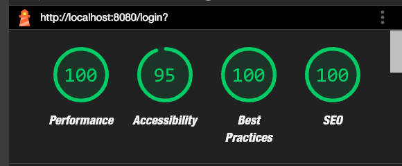

# LinkInPurry

## Overview

> Project ini adalah project yang dibuat untuk memenuhi tugas besar mata kuliah Pengembangan Aplikasi Web. Project ini adalah sebuah website yang mirip dengan LinkedIn, namun dengan fitur yang lebih sederhana. Website ini dibuat menggunakan PHP, Vanilla HTML, dan database dengan PostgreSQL.

## Daftar Isi

- [LinkInPurry](#linkinpurry)
- [Overview](#overview)
- [Daftar Isi](#daftar-isi)
- [Instalasi](#instalasi)
- [Cara Menjalankan Server](#cara-menjalankan-server)
- [Tangkapan Layar Aplikasi](#tangkapan-layar-aplikasi)
- [Pembagian Tugas](#pembagian-tugas)
  - [_Server Side_](#server-side)
  - [_CLIENT SIDE_](#client-side)
  - [_Others_](#others)
- [Bonus](#bonus)
- [Anggota Kelompok](#anggota-kelompok)

## Instalasi

Install php dulu, kalo udah install php, ikutin langkah berikut :

1. Clone repository ini, dengan cara menjalankan `git clone https://github.com/Labpro-21/if3110-tubes-2024-k01-03`
2. Pastikan perangkat sudah terinstall Docker, jika belum install [Docker](https://docs.docker.com/get-docker/), install dulu
3. isi file .env dengan konfigurasi yang sesuai (lihat `.env.example`), letakkan di root folder dan pada folder src.

## Cara Menjalankan Server

1. Jalankan docker dengan perintah `docker compose up --build` pada root folder.
2. Buka browser dan akses `localhost:8080`.
3. Jika ingin menghentikan server, jalankan `docker compose down`.

## Tangkapan Layar Aplikasi

TODO: Masukkin gambar-gambar aplikasi

## Pembagian Tugas

1. Login
2. Register
3. Home (Jobseeker)
4. Home (Company)
5. Search, Sort, dan Filter di Home
6. Tambah Lowongan (Company)
7. Detail Lowongan (Company)
8. Detail Lowongan (Jobseeker)
9. Edit Lowongan (Company)
10. Lamaran
11. Detail Lamaran (Jobseeker)
12. Detail Lamaran (Company)
13. Riwayat
14. Profil

### _Server Side_

| Fitur                             | NIM      |
| ----------------------------------| -------- |
| Login                             | 13522032 |
| Register                          | 13522032 |
| Home (Jobseeker)                  | 13522032, 13522031 |
| Home (Company)                    | 13522032, 13522031 |
| Search, Sort, dan Filter di Home  | 13522032 |
| Tambah Lowongan (Company)         | 13522032 |
| Detail Lowongan (Company)         | 13522032 |
| Detail Lowongan (Jobseeker)       | 13522032 |
| Edit Lowongan (Company)           | 13522032 |
| Lamaran                           | 13522037 |
| Detail Lamaran (Jobseeker)        | 13522037 |
| Detail Lamaran (Company)          | 13522037 |
| Riwayat                           | 13522037 |
| Profil                            | 13522032 |

### _CLIENT SIDE_

| Fitur                             | NIM      |
| ----------------------------------| -------- |
| Login                             | 13522032 |
| Register                          | 13522032 |
| Home (Company)                    | 13522032, 13522031 |
| Home (Jobseeker)                  | 13522031 |
| Search, Sort, dan Filter di Home  | 13522031 |
| Tambah Lowongan (Company)         | 13522032 |
| Detail Lowongan (Company)         | 13522032 |
| Edit Lowongan (Company)           | 13522032 |
| Detail Lamaran (Company)          | 13522037 |
| Detail Lamaran (Jobseeker)        | 13522037 |
| Lamaran                           | 13522037 |
| Riwayat                           | 13522031, 13522037 |
| Profil                            | 13522032 |

### _Others_

| Job                                   | NIM                 |
| --------------------------------------| ------------------- |
| Navbar                                | 13522032            |
| Backend Structure + Design Pattern    | 13522032            |
| Database Schema + Seeding             | 13522032            |
| Docker                                | 13522032            |
| UI/UX                                 | 13522031            |
| Export CSV                            | 13522032            |
| Google LightHouse                     | 13522032            |

## Bonus

1. Export CSV

    Pada fitur ini, company dapat mengekspor data lamaran yang masuk ke dalam bentuk CSV. Fitur ini dapat diakses pada halaman detail lowongan yang dimiliki oleh company.

2. Google LightHouse

    Pada website ini, kami telah melakukan optimisasi pada website kami. Berikut adalah hasil Google LightHouse pada website kami :

    - LOGIN PAGE
    

    - REGISTER PAGE
    

    - HOME PAGE (before)
    

      Pada home page, dilakukan penambahan alt pada gambar mata, sehingga hasilnya menjadi seperti berikut :

    - HOME PAGE (after)
    

    - JOB LISTING PAGE (before)
    

      Pada job listing page, dilakukan penambahan styling pada checkbox, restrukturisasi pada header, dan penambahan aria-label pada tombol delete, sehingga hasilnya menjadi seperti berikut :

    - JOB LISTING PAGE (after)
    

    - LOWONGAN DETAIL PAGE COMPANY
    

    - LOWONGAN ADD PAGE COMPANY
    

    - LOWONGAN EDIT PAGE COMPANY
    

    - PROFILE PAGE COMPANY
    

    - LAMARAN DETAIL PAGE COMPANY
    

    - LOWONGOAN DETAIL JOBSEEKER
    

    - LAMARAN DETAIL PAGE JOBSEEKER
    

    - RIWAYAT PAGE JOBSEEKER
    

## Anggota Kelompok

1. 13522031 - Zaki Chandra Yudistira
2. 13522032 - Tazkia Nizami
3. 13522037 - Farhan Nafis Rayhan
